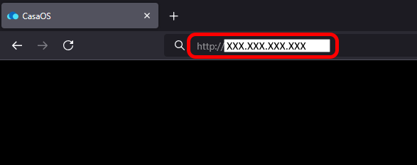
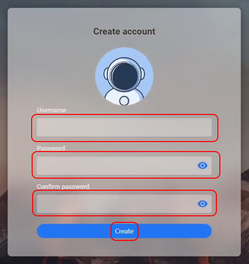

# __CasaOS Setup__

If typing into the terminal window was intimidating, don't worry! We exactly have one more line to enter. Type the following line into terminal and press Enter. A lot of text will start scrolling. Wait for this to finish.

Note: Terminal windows often do not accept `ctrl+v` commands to paste content. If you want to paste the following command, you may have to right-click in the terminal window (on some systems this automatically pastes text) or right-click and select paste.

1. `curl -fsSL https://get.casaos.io | sudo bash`

  - This commands installs [CasaOS](https://casaos.io/) from an online repository, and a lot of text will scroll by while it installs. CasaOS is an operating system which will let you operate your Pi through a graphics-based desktop like an ordinary computer, rather than through a terminal, and lets you make use of many programs written by open-source programmers. And speaking of open-source programmers, we have a [list of open-source programers whose work we'd like you to consider supporting](../donations_list.md). Their hard work makes all of this and so much more possible, and they rely on donations to keep the lights on. The whole world benefits from the labor of open source programmers and they deserve all the support we can give them. (The comic below is not a joke. It is stone-cold reality.)

2. This is the end of your time with terminal! In the final lines of CasaOS's installation output, you should see `- http://XXX.XXX.XXX.XXX (eth0)`. The **XXX.XXX.XXX.XXX** should be the same as the **local IP address** you gave to your Pi and recorded in the previous section. (Remember that **XXX** represents 1-3 digits, and **(eth0)** may be **(wlan0)** if you opted for a non-ethernet connection.) 

 

3. Open an internet browser, type `http://XXX.XXX.XXX.XXX` (your **Raspberry Pi's local IP address**) into the URL bar, and press Enter. This will bring you to a browser webpage where you can access CasaOS, which is now running on your Raspberry Pi! You now have a fully functional mini-computer you can access through your internet browser.
- Note: You can only access your Raspberry Pi using your **Pi's local IP address** from devices which are all connected to the same internet router. We will be making it so that you can access your Pi from anywhere in the world in later sections.

 

4. Create a CasaOS account using the **CasoOS username** and **CasaOS password** you decided on and recorded earlier. This username and password will be how you log into CasaOS from now on.

  

5. You should see a page which looks like the following, with some minor differences. (I have altered my background, removed the Time widget, removed the news and recommended app feeds, and changed the default search bar to Duckduckgo. Duckduckgo is a search system like Google, but unlike Google it doesn't spy on you to sell your search history to advertisers.) 

 

6. Take some time to familiarize yourself with this space. There's not much here yet, but we're going to fill it up with stuff and it's worth being comfortable with before you move on. As an exercise, type something into the search bar and see what happens. Using the Settings button in the top left to change your background, as in the image below.

7. Finally, you need to tell your Pi where to find the Big Bear App Store, so you can use their apps. ("Store" is a bit misleading. All of these applications are free, and depend on your [donations](../donations_list.md) to do the work they do.) First, click on the App icon. Next, click the dropdown menu which says `### apps`, where `###` is some number. This will open a menu. In this menu, click `More Apps`. This will open a bar to type text into. Type `https://icewhale.bigbeartechworld.com/big-bear-casaos.zip` into this bar and press Enter. This will add a list of Apps you can use, maintained by Big Bear and the Big Bear community.

 

 

Now on to the next step. As a gentle introduction to CasaOS, you are going to set up an advertisement / tracker blocker, called Pihole, which will block many ads you might otherwise see while browsing the internet. [Click here to install Pihole](../Instructions/Pihole_Installation.md).

If you want to skip that, you can go straight to installing a [secure communications system and home cloud server using Nextcloud](../Instructions/Nextcloud_Setup_Local.md).

If you want to skip that, you can go straight to installing a [dedicated secure communications system](../Instructions/Databag_Setup_Local.md).
