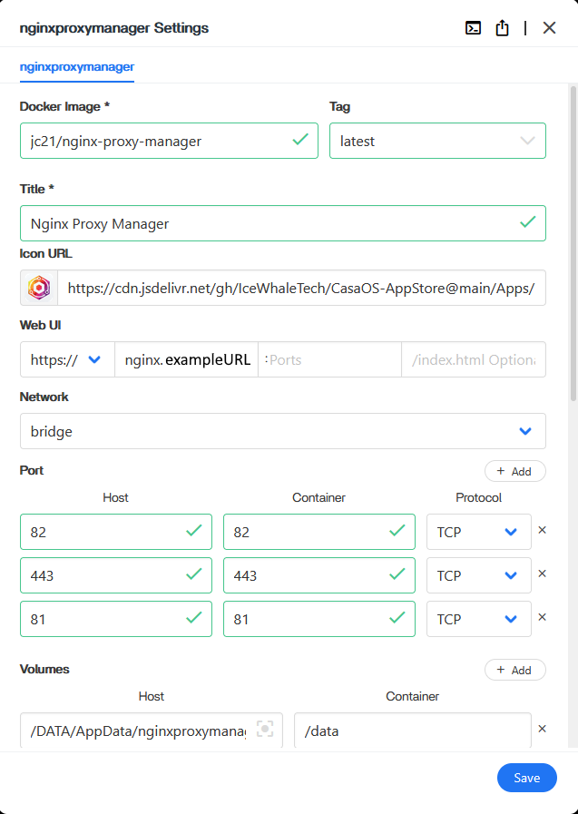
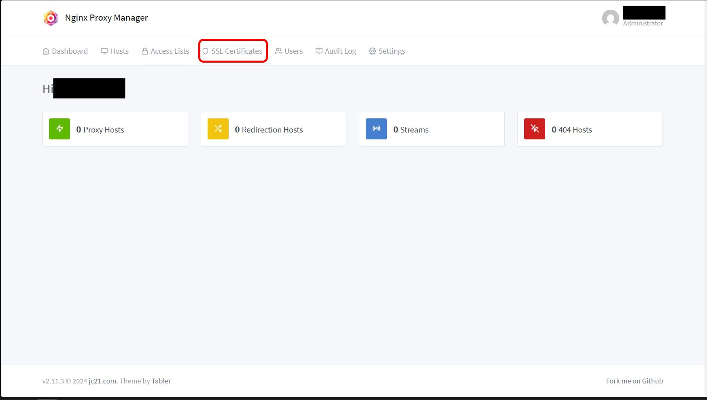

# __Cloudflared | Nginx | Port-Forwarding |  Setup (Connecting Your Pi To The Worldwide Web)__

In this section you will install Nginx Proxy Manager, set up port forwarding on your router, and install a Cloudflared tunnel. Each of these will be one component of letting your Hearth Box connect to the wider internet, and is described in greater detail below.

*Author's Note: Tail Scale and Head Scale are programs which can be used in place of Cloudflare for this, removing even that reliance on a potentially untrusted service provide, and we intend to add tutorial options for them at a later date. However these programs are a bit more technically tricky to set up, and morever require technical effort on the part of everyone who wants to connect to your server beyond simply typing in a URL and logging on to your server, so they are not our focus at this time.* 

## __Cloudflared__

Cloudflared (note the 'd') is a program which connects your server to a Cloudflare tunnel. This ensures that encrypted information always goes through Cloudflare, where it is properly encrypted and protected from eavesdroppers. [Here is an explanation, if you are curious.](https://developers.cloudflare.com/cloudflare-one/connections/connect-networks/)

1. If you do not already have it open, access your Raspberry Pi by entering its `local IP address` into your web browser. Open the `App Store` button. Navigate to the "Cloudflared" installer either by scrolling down, or typing `cloudlflared` into the search bar. Then click `Install`.

  

2. This should bring up the following installation window, which you can scroll to see the entirety of. Add your **Raspberry Pi's local IP address** to the leftmost text box under "Web UI". The click `Save`. This tells your server that you want to connect to this program via your local router, not the worldwide web. (You will only be able to access this program from a machine connected to your local router, but that's fine, you only need to use it once.

3. Before beginning, you should have created a text file named `Cloudflare_Tunnel.txt`. Open it. Select all the text within, then press `CTRL + C` (for Linux or Windows) or `CMD + C` (for Mac) to *Copy* the text within.

4. Click the `Cloudflared` program icon. This will open a new tab with your Cloudflared program. Click inside the text box beneath **Enter Tunnel Connector Token:". Then `CTRL + V` (for Linux or Windows) or `CMD + V` (for Mac) to *Paste* the text from `Cloudlflared_Tunnel.txt`.

 

5. Press the `Save` button. It will turn into `Start` button. Press the `Start` button. Close out of the Cloudflared tab and delete `Cloudflared_Tunnel.txt`.

That's it! That's all you have to do with Cloudflared.

Note: If you ever move / get a new router, you may have to refresh your token. Do so by returning to the Tunnel page (see the [Cloudflare section](../Instructions/Cloudflare_(Web_URL).md)), clicking the **3 menu dots** next to your tunnel, clicking **Configure**, clicking **Docker**, and then clicking **Refresh Token**. Then copy the new token, as previously, and open Cloudflared. Press **Stop**, paste the new token, then press **Save** and then **Start**.

## __Nginx Proxy Manager__

Nginx Proxy Mananager creates what is known as a "reverse proxy" for the server on your Hearth Box. This is a bit of software which stands between your server and the worldwide web. It handles the mathematics of encryption for your server, and makes it more difficult for hackers and eavesdroppers to access your server directly. ([Here is an explanation, if you are curious.](https://www.cloudflare.com/learning/cdn/glossary/reverse-proxy/))

6. If you do not already have it open, access your Raspberry Pi by entering its `local IP address` into your web browser. Open the `App Store` button. Navigate to the "Nginx Proxy Manager" installer either by scrolling down, or typing `nginx` into the search bar. Then click `Install`. 

  

7. This should bring up the following installation window, which you can scroll to see the entirety of. Most of the following should already be entered, but check each installation field to ensure they have the following values:
- Docker Image: `jc21/nginx-proxy-manager`
- Tag: `latest`
- Title: `Nginx Proxy Manager`
- Icon URL: `https://cdn.jsdelivr.net/gh/IceWhaleTech/CasaOS-AppStore@main/Apps/NginxProxyManager/icon.png`
- Web UI:
  - Left button: `https://` (IMPORTANT: Note the "s". Use `https`, not `http`. The "s" signifies a "secure" connection.)
  - Leftmost text field: `nginx.exampleweburl`, where you replace `examplewebURL` with your Hearth Box's **Web URL**. Note that this should include the suffix `.com`, `.org`, or whatever else you selected.
- Network: `bridge`
(Click the `+ Add` button to the right of "Port" to add additional Host | Container | Protocol values.)
(These Host | Container values are "port" addresses, appended to a URL as `examplewebURL:XXX`, and can technically be any matching pair so long as they do not overlap with the port values of another program or device. For simplicity, please use the port values listed for all programs unless you are an expert user.)
- Ports:
  - Host: `82`| Container: `82` | Protocol: `TCP`
  - Host: `443`| Container: `443` | Protocol: `TCP`
  - Host: `81`| Container: `81` | Protocol: `TCP`
(Click the `+ Add` button to the right of "Volumes" to add additional Host | Container values.)
(These Host | Container values are the folder locations within your Raspberry Pi where parts of this program will be stored. For simplicity, please use the values listed unless you are an expert user.)
- Volumes:
  - Host: `/DATA/AppData/nginxproxymanager/data` | Container: `/data`
  - Host: `/DATA/AppData/nginxproxymanager/etc/letsencrypt` | Container: `/etc/letsencrypt`
- CPU Shares: `High`
- Restart Policy: `unless-stopped`
- Container Name: `nginxproxymanager`

When you are finished, click 'Save'.

  

8. Next you need to open Nginx Proxy Manager. When you are finished with this section, you will be able to do so by clicking the `Nginx Proxy Manager`. However, the `Web UI` field is configured so that clicking on this icon opens the web URL `https://nginx.examplewebURL`, and you do not yet have web connectivity enabled. Your Hearth Box can still only be connected to via your **Raspberry Pi's local IP address**. Instead, open a new web browser page and type into the address bar `http://XXX.XXX.XXX.XXX:82`, where **XXX.XXX.XXX.XXX** is your **Raspberry Pi's local IP address**. Then press Enter.

Reminder: Using your **Raspberry Pi's local IP address** to access your Hearth Box will only work when you are connecting to the internet through the same local router as your Raspberry Pi.

9. You should see the Nginx login page. In the next step you will set up your own personal **Nginx email** and **Nginx password**, but right now you will use the Nginx default email and password to log in. These are `admin@example.com` and `changeme` respectively. Type these into the `Email address` and `Password` boxes, then press `Sign In`.

 

10. Click the account icon in the top right. Then click `Edit Details`. Change the "Email" box to your desired **Nginx Email**. You can change the "Full Name" and "Nickname" if you want, but it's not necessary. When you're finished, click `Save`.

  

11. Click the account icon in the top right. Then click `Change Password`. If the "Current Password" is not automatically filled in, type in `changeme`. Type your desired **Nginx password** into the "New Password" and "Confirm Password" boxes. When you're finished, click `Save`.

  

### __Adding An SSL Certificate And Private Key To Nginx__

12. Next you need to give Nginx your **SSL Certificate**, so it can perform encryption (an explanation of [SSL certificates](https://www.cloudflare.com/learning/ssl/what-is-an-ssl-certificate/) and [encryption](https://en.wikipedia.org/wiki/Public-key_cryptography) if you are curious). Click the `SSL Certificate` tab. Click `Add SSL Certificate`.

  

13. Enter your **Web URL** into the "Name" text box. 

14. Click the `Browse` button attached to "Certificate Key". Before beginning, you should have created a text file named `Cloudflare_SSL_Private_Key.txt`. Navigate to this file and select it, then click `Open`.

15. Click the `Browse` button attached to "Certificate". Before beginning, you should have created a text file named `Cloudflare_SSL_Certificate.txt`. Navigate to this file and select it, then click `Open`. Then click `Save`.

 

### __Adding A New Program To Nginx__

Pay careful attention to this section. You will need to repeat step 16-20 with a slight modification to `examplewebURL` each time you want to connect a program on your Hearth Box to the worldwide web.

First, we will connect your CasaOS dashboard to the web.

16. Click `Dashboard`, and then click `Proxy Hosts`. Click `Add Proxy Hosts.`

  

17. Under "Domain Names" enter `examplewebURL` where you replace `examplewebURL` with your Hearth Box's **Web URL**. Note that `examplewebURL` should include the suffix `.com`, `.org`, or whatever else you selected earlier.

18. Set the "Scheme" to `https`, where the "s" signifies a "secure" connection. In the "Forward Hostname / IP" text box, enter your **Raspberry Pi's local IP address**. In the "Forward Port" text box, enter `443`. (This is the "port" used to talk to websites preprended with "https".)

19. Click the following buttons to turn their options on: `Cache Assets`, `Block Common Exploits`, `Websockets Support`. Then click the `SSL` tab.

20. Click inside the "SSL Certificate" box. From the drop down menu, click on the certificate with the name you entered in step 8. This should be your **Web URL**. Click the `Force SSL` and `HTTP/2 Support` options to turn them on. Then click `Save`.

 

This makes it so that your Raspberry Pi can securely accept requests to see your Hearth Box's **Web URL**! If you type `examplewebURL` into a web browser, where `examplewebURL` is your **Web URL**, it should take you to your CasaOS dashboard!

21. However, to access specific programs from the web, you will have to configure their own web URLs, with the appropriate prefixes. To configure "Nginx Proxy Manager", repeat steps 16-20, but replace `examplewebURL` with `nginx.examplewebURL`.

This makes it so that when you click the "Nginx Proxy Manager" icon on your CasaOS dashboard, or type `nginx.examplewebURL` (where `examplewebURL` is your **Web URL**) into a web browser, it will take you to Nginx!

As a gentle introduction to CasaOS, you are going to set up an advertisement / tracker blocker, called Pi-hole, which will block many ads you might otherwise see while browsing the internet. [Click here to install Pi-hole](../Instructions/Pi-hole_Installation.md).

If you want to skip that, you can go straight to installing a [secure communications system and home cloud server using Nextcloud](../Instructions/Nextcloud_Setup_Local.md).

If you want to skip that, you can go straight to installing a [dedicated secure communications system](../Instructions/Databag_Setup_Local.md).
