to-do:
- I'm pretty sure the current configuration I have leaves traffic readable by Cloudflare. Check if there's a way around this other than getting both parties to go through the hassle of Tailscale.  
- We might also need to change the Zero Trust instructions for dietpi with Secure Communications Only.

# __Instructions__

These instructions will get you a web domain, with a unique URL, which as of 2024 costs ~$10/yr, along with the services of an organization known as Cloudflare to route web traffic through it.

Note: Updates to Cloudflare's user interface may cause the website's layout to be different than the following pictures. Hopefully they will still be a helpful visual aid if so.

First, go to [IPchicken](https://ipchicken.com/) to find your router's **global IP address**. It should be of the form **XXX.XXX.XXX.XXX**, where each **XXX** can be 1, 2, or 3 digits. **Save this.** It will be used throughout the rest of this instruction page, and for future instructions as well.

Second, go to [Cloudflare's website](https://www.cloudflare.com/) and click the `Sign Up` to make an account. Select the `Free` option.

Once you have an account, go to your [Cloudflare dashboard](https://dash.cloudflare.com). You should be at `Account Home`. If not, click that tab on the left. Click `Add A New Domain`, then `Or register a new domain ->`. Enter your desired URL into the search bar to see if it's available. We recommend selecting a **.org** or **.com** address, as these are open to anyone to register. `Confirm` your desired URL and purchase it. 

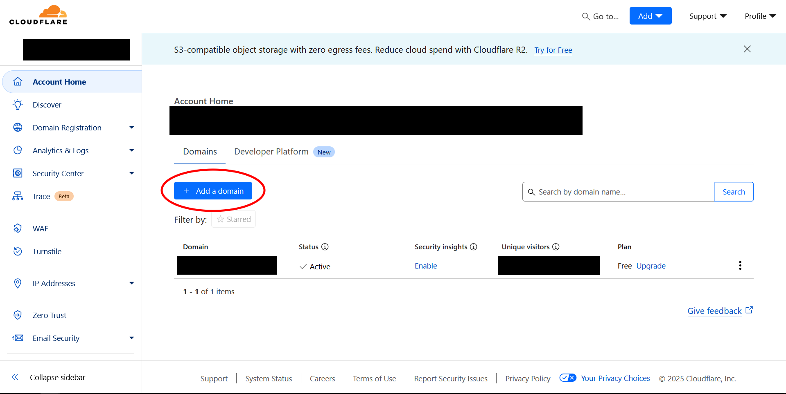 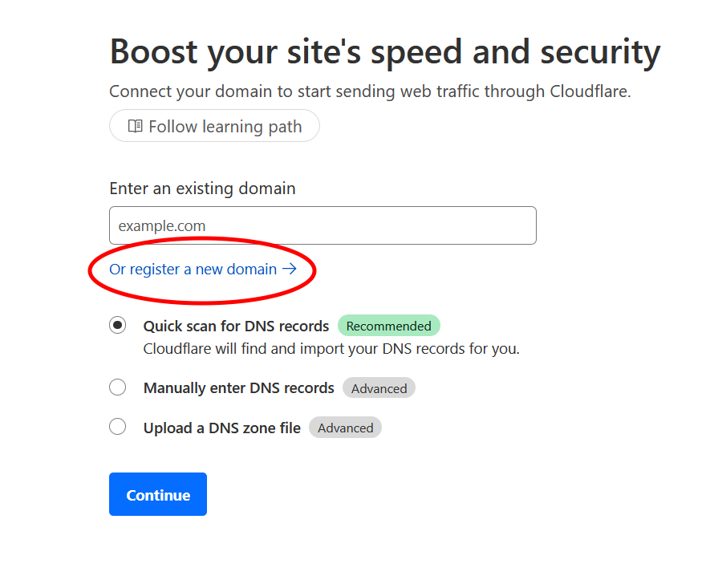 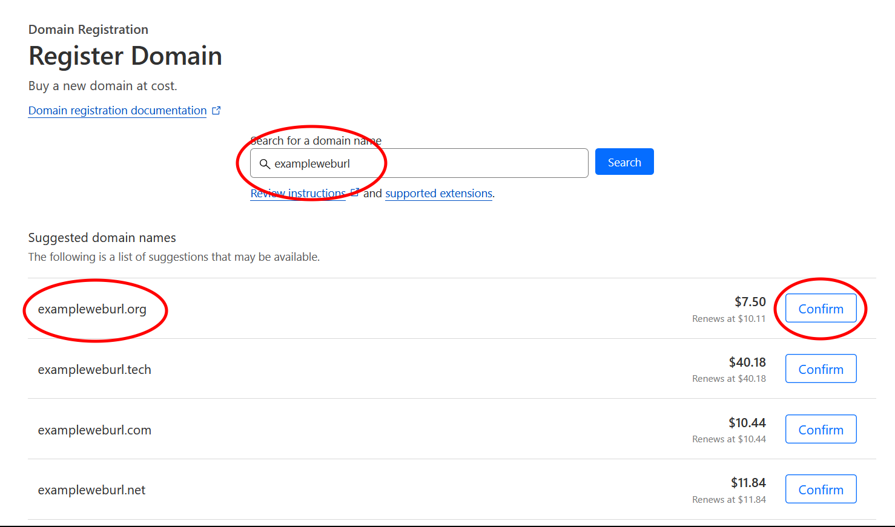 

**NOTE:** If you do not renew your URL when your payment period is finished, you will lose it. If you are using this for secure communication that is a security risk, as someone else could take the URL and pretend to be your secure server.

Return to Cloudflare's `Account Home`. Click your chosen URL under `Domain`. Click the `DNS` (Domain Name System) tab on the left, then click `Add A Record` (you may have to scroll down to find this). Make sure the `Type` field is **A**, the `Name` field is **@**, and the `Proxy Status` switch is set to **Proxied**. Enter the global IP address you found above into the `IPv4 address` field. Then click `Save`. To creates an internet record which lets computers find your device when your URL is typed into a browser.

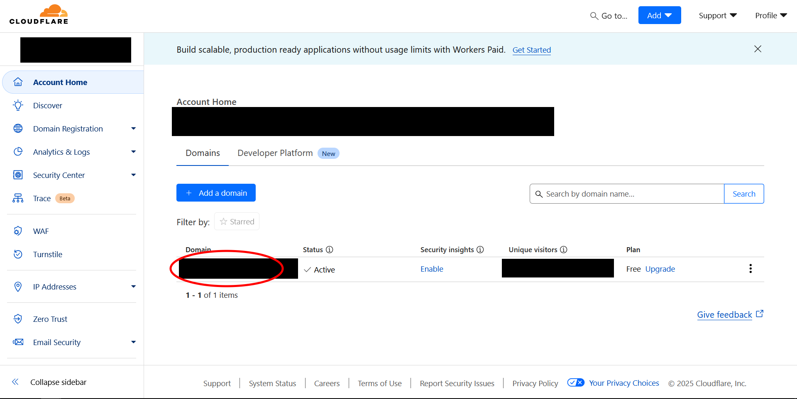 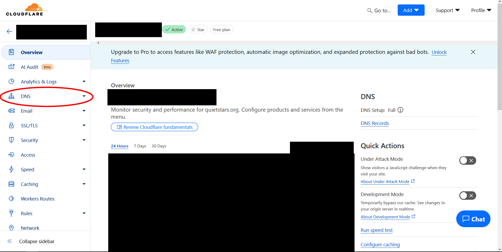 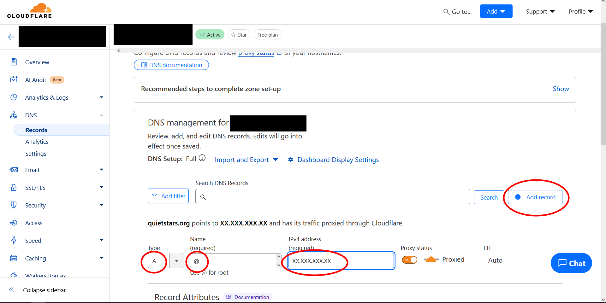 

Note: If you move your equipment so that it is connected to a different internet router, during a home move for example, you will need to use [IPchicken](https://ipchicken.com/) to find your new global IP address and change the `IPv4 address` field here to that new value.

Next we will set up a "tunnel", which allows encryption and decrytion of the information which passes through your web domain, ensuring it occurs safely within you self-hosted server. 

Return to `Account Home` (there is a back arrow in the top left which will take you there). Click `Zero Trust` on the left. Click `Networks` on the left. Click `Create a tunnel`. Select `Cloudflared`. Enter a tunnel name and click `Save Tunnel`. You do not have to record this name and it will be here on your Cloudflare account if you ever need it again. Select `Docker` (this is one of the operating softwares, like Windows or Mac, underlying what you will install later). Click the two-overlapping-pages icon to **copy** the text which appears.

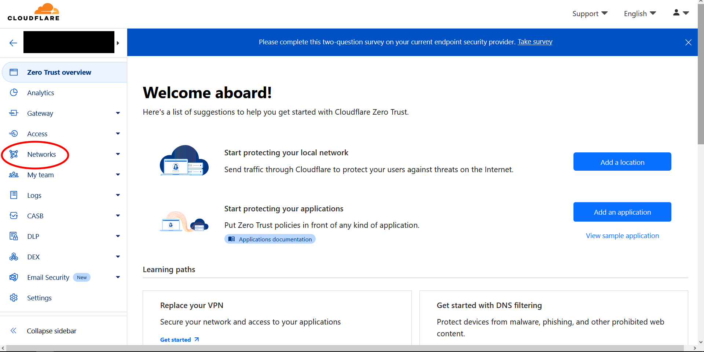 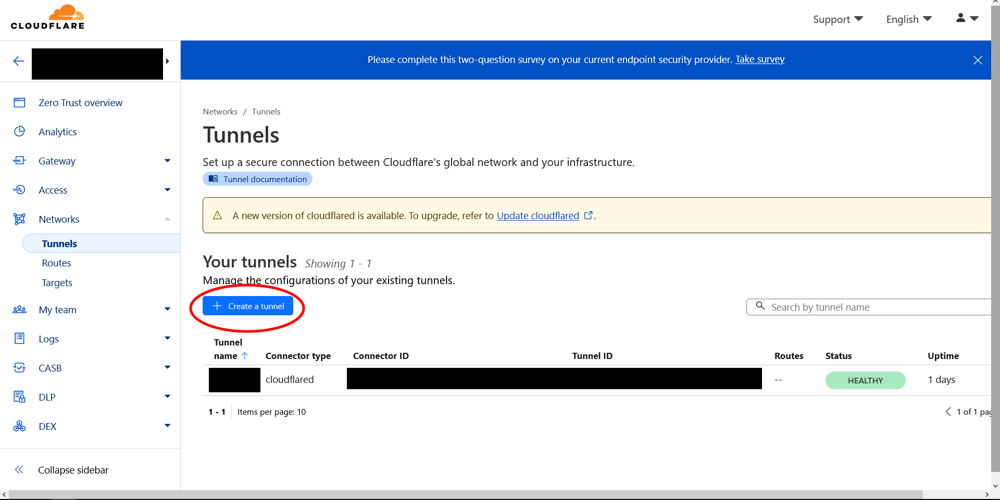 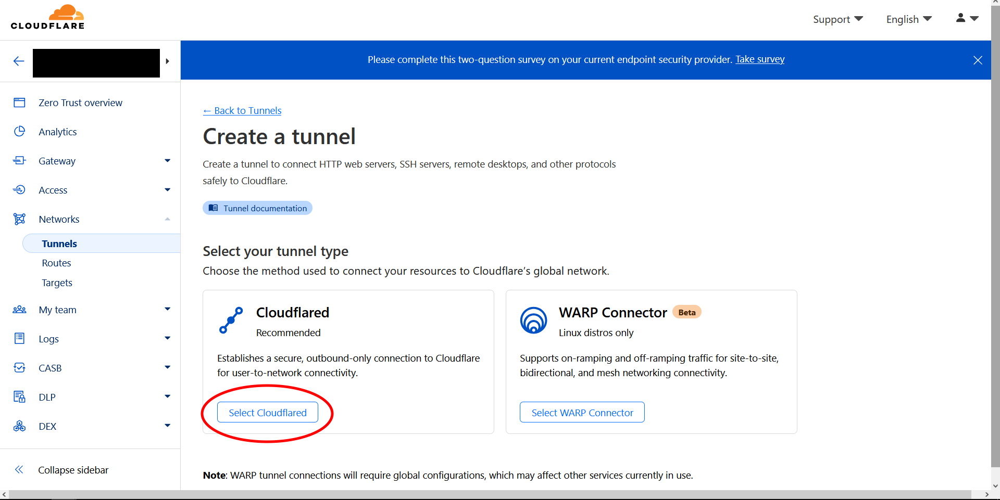

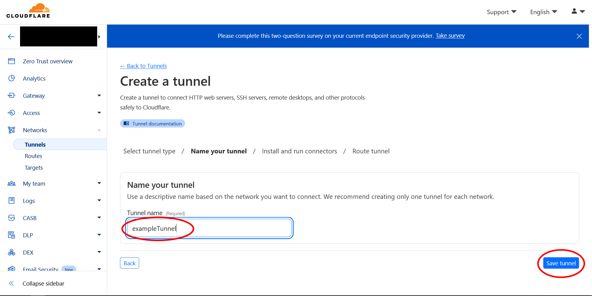 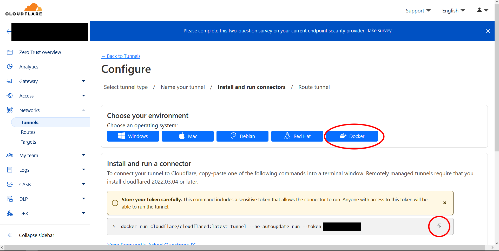

Navigate to a folder on your computer you will remember later. Create a new text file in that folder. On Windows, you do this by right clicking inside the folder, scrolling down to `New`, then scrolling down to `New Text Document`. Then **paste** the text you copied into the new text document and save it. We will need this later. Finally, return to the Cloudflare webpage, scroll down, and click `Next` at the bottom of the page. This will take you to the page below. (Note that the `Save` button will either say `Save Tunnel` or `Save Hostname` depending on what point of the process you are at.)

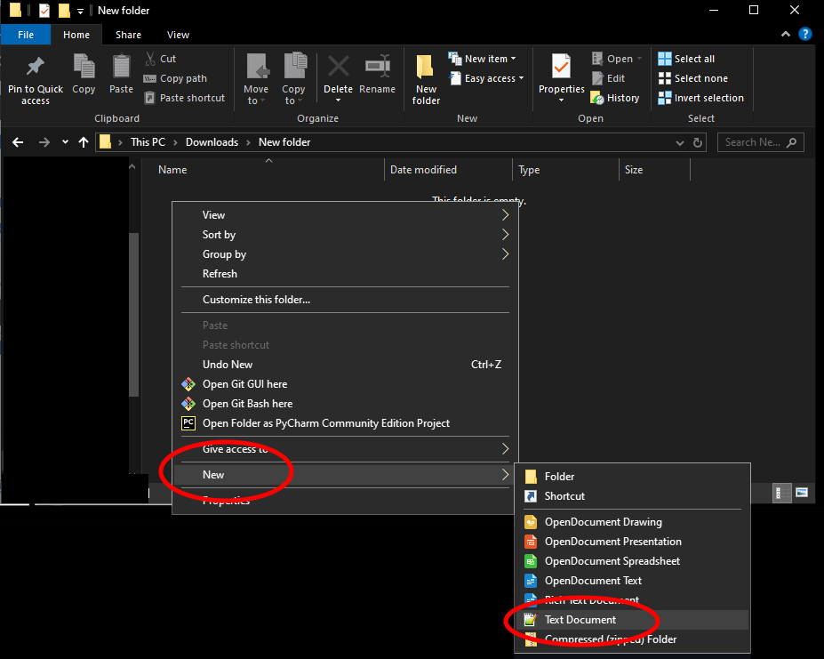 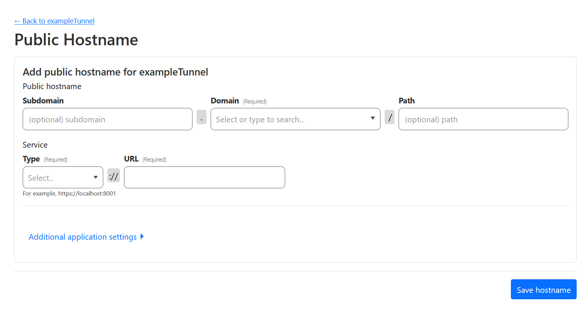

What you do next depends on whether you are setting up a full home server, or just a secure communications hub. Follow the instructions below based on your choice. Either way, this next step will set up a series of sub-websites which you will use to access various functions of your Raspberry Pi. For example, `databag.[exampleweburl].org` will take you to your secure communications hub. Meanwhile `nginx.[exampleweburl].org` will take you to part of your device's security interface, and `pihole.[exampleweburl].org` will take you to the control panel for an adblocker which will reduce the number of ads for all devices on your internet.

## __Full Home Server and Secure Communications__

### __nginx__

Once your system is set up, this URL will take you to part of your device's security interface.

In the `subdomain` section, enter **nginx**. In the `domain` section, select your chosen URL from the drop-down list. Under `type` select **HTTP**. Under `URL`, enter your **Global IP address** followed by **:81**. It should have the form: **XXX.XXX.XXX.XXX:81**. Click `Save`. Then select your tunnel name to enter the next public hostname.

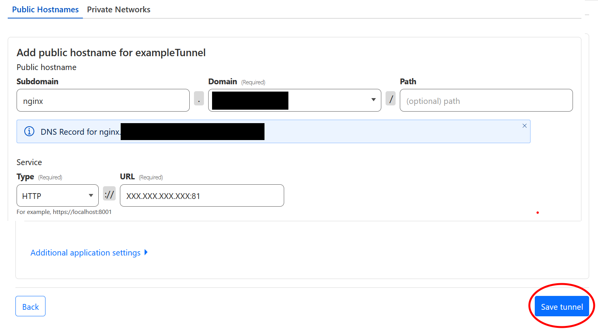 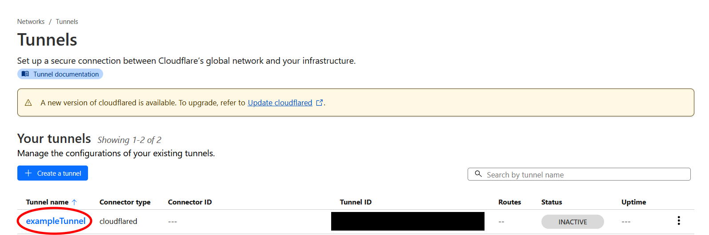 

## __Databag__

Once your system is set up, this URL will take you to your secure communication hub.

In the `subdomain` section, enter **databag**. In the `domain` section, select your chosen URL from the drop-down list. Under `type` select **HTTP**. Under `URL`, enter your **Global IP address** followed by **:7000**. It should have the form: **XXX.XXX.XXX.XXX:7000**. Click `Save`. Then select your tunnel name to enter the next public hostname.

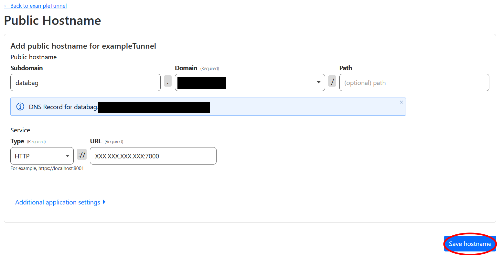  

## __Nextcloud__

Once your system is set up, this URL will take you to your new cloud server, where you can back up and share files. This will incidentally host a secondary communication hub. 

In the `subdomain` section, enter **nextcloud**. In the `domain` section, select your chosen URL from the drop-down list. Under `type` select **HTTP**. Under `URL`, enter your **Global IP address** followed by **:7580**. It should have the form: **XXX.XXX.XXX.XXX:7580**. Click `Save`. Then select your tunnel name to enter the next public hostname.

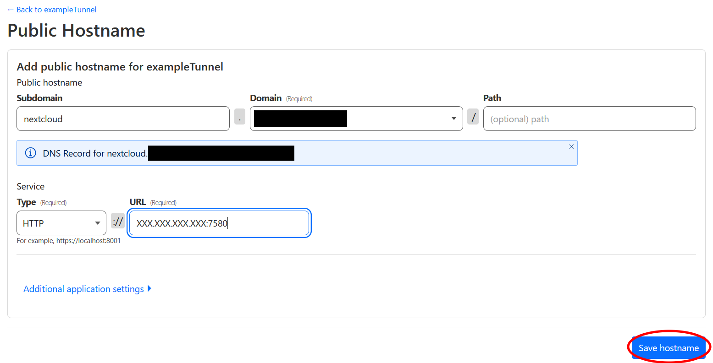  

## __Pihole__

Once your system is set up, this URL will take you to the control panel for an adblocker which will reduce the number of ads for all devices on your internet.

In the `subdomain` section, enter **pihole**. In the `domain` section, select your chosen URL from the drop-down list. Under `type` select **HTTP**. Under `URL`, enter your **Global IP address** followed by **:8080**. It should have the form: **XXX.XXX.XXX.XXX:8080**. Click `Save`. 

 

You are finished with Cloudflare! Your next step will be to [image an operating system onto your Raspberry Pi](../Instructions/Raspberry_Pi_Image_Decision.md).

## __Secure Communications Only__

under construction
