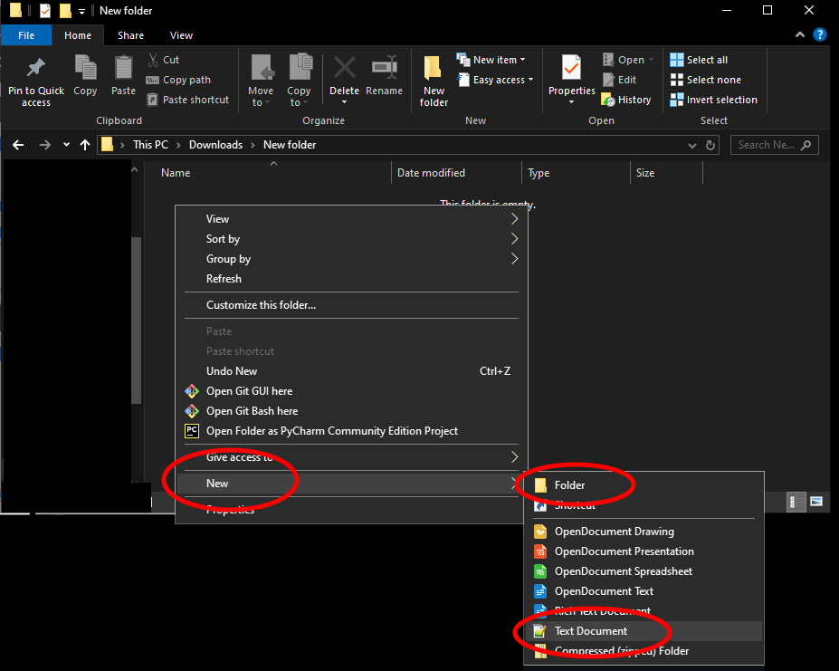
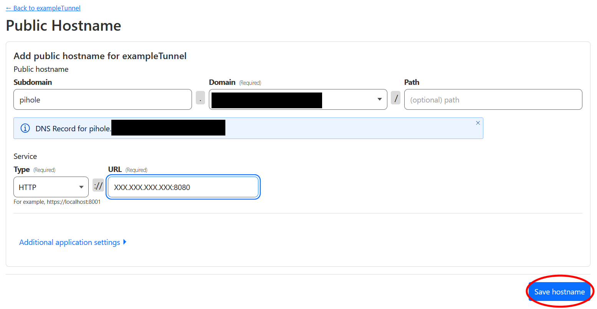

to-do:
- Add RTC protocol thing for Databag.
- I'm pretty sure the current configuration I have leaves traffic readable by Cloudflare. Check if there's a way around this other than getting both parties to go through the hassle of Tailscale.  
- We might also need to change the Zero Trust instructions for dietpi with Secure Communications Only.

# __Instructions__

This section will show you how to get a web domain and sign up for Cloudflare, a company which provides (among other things) web traffic routing services. As of 2025, Cloudflare's services cost about $10/yr. This section may be harder to understand if you're unfamiliar with internet backend terminology, but it's not technically complicated. In essence, you're filling out paperwork.

Note: Updates to Cloudflare's website may cause its user interface or layout to differ from its depiction in the following images. If this is the case, please leave a note in the `Issues` tab of the Locus Server's Github repository.

1. Go to [IPchicken](https://ipchicken.com/) to find your router's **global IP address**. It should be of the form **XXX.XXX.XXX.XXX**, where each **XXX** can be 1, 2, or 3 digits. This is the mailbox for your piece of the internet. **Write this down.** It will be used in this section and future sections.

2. Go to [Cloudflare's website](https://www.cloudflare.com/). We recommend bookmarking this website in case you ever need to manage your account in the future. Click the `Sign Up` button to make an account. Select the `Free` option.

**Note:** "Free" means that you are opting to not pay for Cloudflare support and extra features. Businesses need these features, but you do not. You *will* still have to pay for the web domain you will be using.

3. Once you have an account, go to your [Cloudflare dashboard](https://dash.cloudflare.com). You should be at `Account Home`. If not, click that tab on the left. Click `Add A New Domain`, then `Or register a new domain ->`. Enter your desired URL into the search bar to see if it's available. We recommend selecting a **.org** or **.com** address, as these are open to anyone to register. `Confirm` your desired URL and purchase it. 

   

**Warning:** Ensure that you always renew your URL before your payment period ends for as long as you intend to continue using the server. If you do not renew your URL before your payment period is finished, then you will lose the URL. If you are using this for secure communication, that is a security risk, as someone else could take the URL and pretend to be your secure server.

4. Return to Cloudflare's `Account Home`. Click your chosen URL under `Domain`. Click the `DNS` (Domain Name System) tab on the left, then click `Add A Record`. You may have to scroll down to find `Add A Record`. Make sure the `Type` field is **A**, the `Name` field is **@**, and the `Proxy Status` switch is set to **Proxied**. Enter the global IP address you found in Step 1 into the `IPv4 address` field. Then click `Save`. You now have an internet record which lets computers find your device by using your chosen URL.

   

**Caution**: If you move your equipment so that it is connected to a different internet router (if you move apartments, for example), your global IP address will change. Repeat Step 1 to find your new global IP address, then change the `IPv4 address` field in this Step to that new value.

Next, you will set up a "tunnel". This allows encryption of the information which is sent to your web domain and ensures that encrypted information is only decrypted within the safety of your self-hosted server. 

5. Return to `Account Home`. On the left-hand side of your screen, click `Zero Trust`. This will take you to a screen where you enter a team name. Enter whatever you want, you don't have to record this.

  

6. Next click `Networks`, and finally `Create a tunnel`. Select `Cloudflared`. Enter a name for your tunnel and click `Save Tunnel`. You do not have to record this name - it will be here on your Cloudflare account if you ever need it again. Select `Docker`. Select the text which appears, then either click the **Copy** icon or press **CTRL + C** (for Linux or Windows) or **CMD + C** (for Mac) to *Copy* that text.

 

 

6. If you haven't already, create a dedicated folder for information about your server on your computer. Open this folder. If you already have a dedicated folder, navigate to it.
  
7. Within this folder, create a new plaintext file (plaintext files have the file extension **.txt**). Open this file, then press **CTRL + V** (for Linux or Windows) or **CMD + V** (for Mac) to *Paste* the text you copied in Step 5 into the file. Save this file and leave it open. You will need this later.

8. Finally, return to the Cloudflare webpage, scroll down, and click `Next` at the bottom of the page. This will take you to the page pictured below.
  
**Note:** Depending on what part of the process you're at, the `Save` button will either say `Save Tunnel` or `Save Hostname`.

 

What you do next depends on whether you are setting up a full home server or only a secure communications hub. Follow the instructions below based on your choice. Either way, this next step will set up a series of sub-websites which you will use to access various functions of your Raspberry Pi. For example, `databag.[exampleweburl].org` will take you to your secure communications hub. Meanwhile `nginx.[exampleweburl].org` will take you to part of your device's security interface, and `pihole.[exampleweburl].org` will take you to the control panel for an adblocker which will reduce the number of ads for all devices on your internet.

## __Full Home Server and Secure Communications__

### __nginx__

Once your system is set up, this URL will take you to part of your device's security interface.

In the `subdomain` section, enter **nginx**. In the `domain` section, select your chosen URL from the drop-down list. Under `type` select **HTTP**. Under `URL`, enter your **Global IP address** followed by **:81**. It should have the form: **XXX.XXX.XXX.XXX:81**. Click `Save`. Then select your tunnel name to enter the next public hostname.

  

## __Databag__

Once your system is set up, this URL will take you to your secure communication hub.

In the `subdomain` section, enter **databag**. In the `domain` section, select your chosen URL from the drop-down list. Under `type` select **HTTP**. Under `URL`, enter your **Global IP address** followed by **:7000**. It should have the form: **XXX.XXX.XXX.XXX:7000**. Click `Save`. Then select your tunnel name to enter the next public hostname.

  

## __Nextcloud__

Once your system is set up, this URL will take you to your new cloud server, where you can back up and share files. This will incidentally host a secondary communication hub. 

In the `subdomain` section, enter **nextcloud**. In the `domain` section, select your chosen URL from the drop-down list. Under `type` select **HTTP**. Under `URL`, enter your **Global IP address** followed by **:7580**. It should have the form: **XXX.XXX.XXX.XXX:7580**. Click `Save`. Then select your tunnel name to enter the next public hostname.

  

## __Pihole__

Once your system is set up, this URL will take you to the control panel for an adblocker which will reduce the number of ads for all devices on your internet.

In the `subdomain` section, enter **pihole**. In the `domain` section, select your chosen URL from the drop-down list. Under `type` select **HTTP**. Under `URL`, enter your **Global IP address** followed by **:8080**. It should have the form: **XXX.XXX.XXX.XXX:8080**. Click `Save`. 

 

You are finished with Cloudflare! Hallelujah! Your next step will be to [image an operating system onto your Raspberry Pi](../Instructions/Raspberry_Pi_Image_Decision.md).

## __Secure Communications Only__

*Under construction. Please check back later!*
