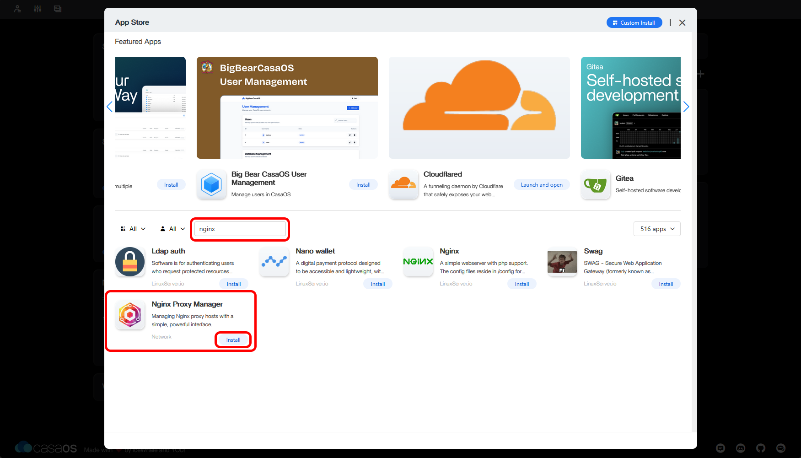
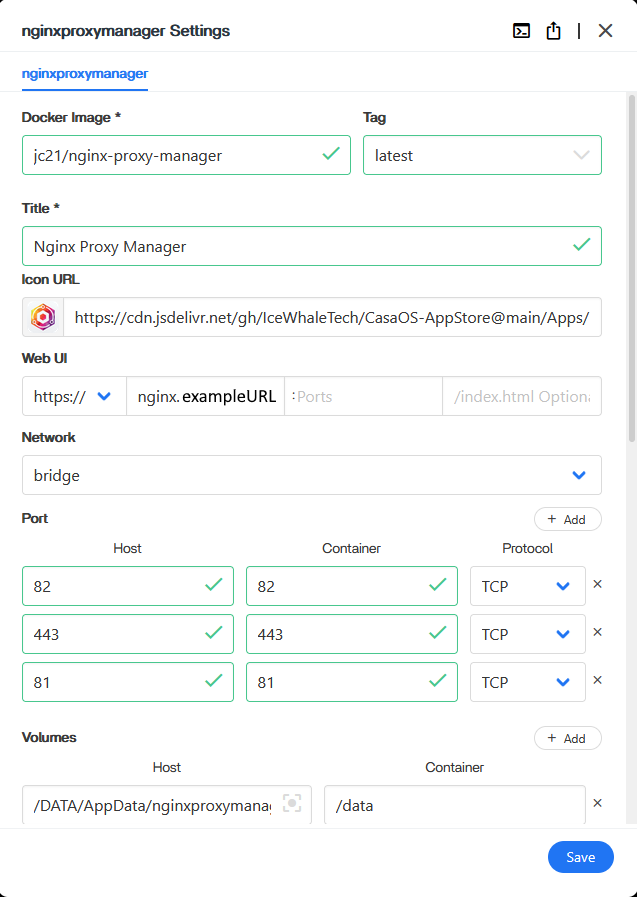
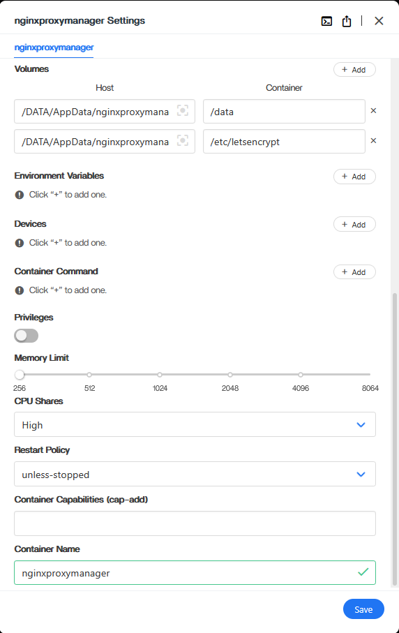

# __Nginx | Port-Forwarding | Cloudflared Tunnel Setup (Connecting Your Pi To The Worldwide Web)__

In this section we will install Nginx Proxy Manager, set up port forwarding on your router, and install a Cloudflared tunnel. Each of these will be one component of letting your Hearth Box connect to the wider internet, and is described in greater detail below.

## __Nginx Proxy Manager__

Nginx Proxy Mananager creates what is known as a "reverse proxy" for the server on your Hearth Box. This is a bit of software which stands between your server and the worldwide web. It handles the mathematics of encryption for your server, and makes it more difficult for hackers and eavesdroppers to access your server directly. ([Here is an explanation, if you are curious.](https://www.cloudflare.com/learning/cdn/glossary/reverse-proxy/))

1. If you do not already have it open, access your Raspberry Pi by entering its `local IP address` into your web browser. Open the `App Store` button. Navigate to the Nginx Proxy Manager installer either by scrolling down, or typing `nginx` into the search bar. Then click `Install`. 

  

2. This should bring up the following installation window, which you can scroll to see the entirety of. Make sure each installation field has the following values:
- Docker Image: `jc21/nginx-proxy-manager`
- Tag: `latest`
- Title: `Nginx Proxy Manager`
- Icon URL: `https://cdn.jsdelivr.net/gh/IceWhaleTech/CasaOS-AppStore@main/Apps/NginxProxyManager/icon.png`
- Web UI:
  - Left button: `https://` (IMPORTANT: Note the "s". Use `https`, not `http`. The "s" signifies a "secure" connection.)
  - Leftmost text field: `nginx.exampleweburl`, where you replace `examplewebURL` with your Hearth Box's **Web URL**. Note that this should include the suffix `.com`, `.org`, or whatever else you selected.
- Network: `bridge`
(Click the `+ Add` button to the right of "Port" to add additional Host | Container | Protocol values.)
(These Host | Container values are "port" addresses, appended to a URL as `examplewebURL:XXX`, and can technically be any matching pair so long as they do not overlap with the port values of another program or device. For simplicity, please use the port values listed for all programs unless you are an expert user.)
- Ports:
  - Host: `82`| Container: `82` | Protocol: `TCP`
  - Host: `443`| Container: `443` | Protocol: `TCP`
  - Host: `81`| Container: `81` | Protocol: `TCP`
(Click the `+ Add` button to the right of "Volumes" to add additional Host | Container values.)
(These Host | Container values are the folder locations within your Raspberry Pi where parts of this program will be stored. For simplicity, please use the values listed unless you are an expert user.)
- Volumes:
  - Host: `/DATA/AppData/nginxproxymanager/data` | Container: `/data`
  - Host: `/DATA/AppData/nginxproxymanager/etc/letsencrypt` | Container: `/etc/letsencrypt`
- CPU Shares: `High`
- Restart Policy: `unless-stopped`
- Container Name: `nginxproxymanager`

  

As a gentle introduction to CasaOS, you are going to set up an advertisement / tracker blocker, called Pi-hole, which will block many ads you might otherwise see while browsing the internet. [Click here to install Pi-hole](../Instructions/Pi-hole_Installation.md).

If you want to skip that, you can go straight to installing a [secure communications system and home cloud server using Nextcloud](../Instructions/Nextcloud_Setup_Local.md).

If you want to skip that, you can go straight to installing a [dedicated secure communications system](../Instructions/Databag_Setup_Local.md).
