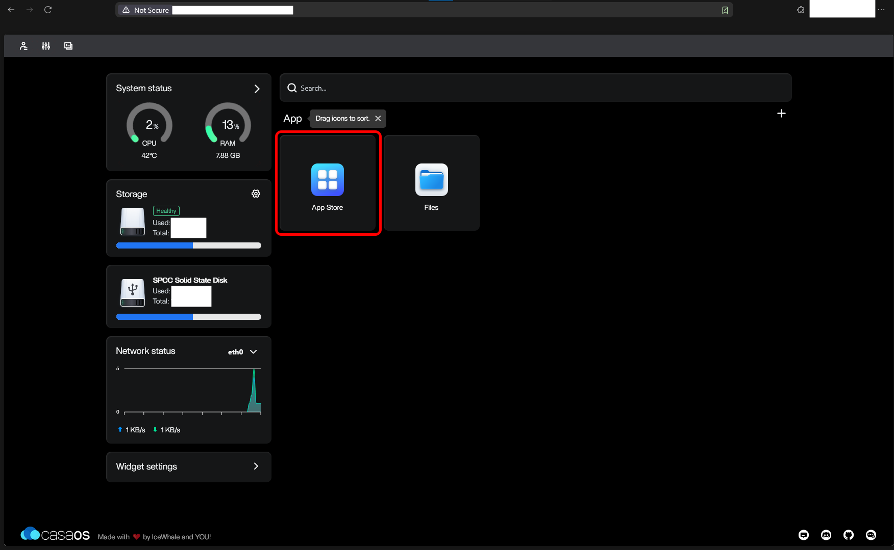

# __Nginx | Cloudflared Tunnel | Setup (Connecting Your Pi To The Worldwide Web)__

Nginx Proxy Mananager creates what is known as a "reverse proxy" for the server on your Hearth Box. This is a bit of software which stands between your server and the worldwide web. It handles the mathematics of encryption for your server, and makes it more difficult for hackers and eavesdroppers to access your server directly. ([Here is an explanation, if you are curious.](https://www.cloudflare.com/learning/cdn/glossary/reverse-proxy/))

1. If you do not already have it open, access your Raspberry Pi by entering its `local IP address` into your web browser. Open the `App Store` button. Navigate to the Nginx Proxy Manager installer either by scrolling down, or typing `nginx` into the search bar. Then click `Install`. 

 

As a gentle introduction to CasaOS, you are going to set up an advertisement / tracker blocker, called Pi-hole, which will block many ads you might otherwise see while browsing the internet. [Click here to install Pi-hole](../Instructions/Pi-hole_Installation.md).

If you want to skip that, you can go straight to installing a [secure communications system and home cloud server using Nextcloud](../Instructions/Nextcloud_Setup_Local.md).

If you want to skip that, you can go straight to installing a [dedicated secure communications system](../Instructions/Databag_Setup_Local.md).
