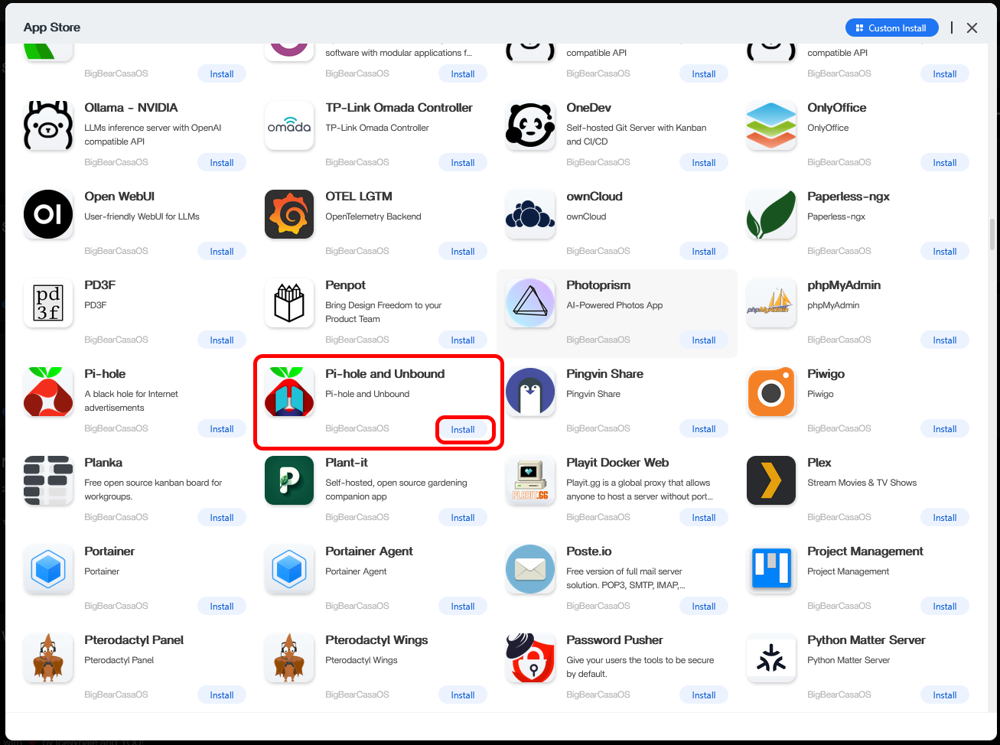

# __Pi-hole Installation__

0. If it is not already open, open CasaOS by entering your Raspberry Pi's **local IP address** into a browser URL bar, from a computer connected to your home internet.

1. Open the `App Store` on CasaOS. Scroll until you find `Pi-hole and Unbound`, with BigBearCasaOS as the category. Click `Install`.

 
