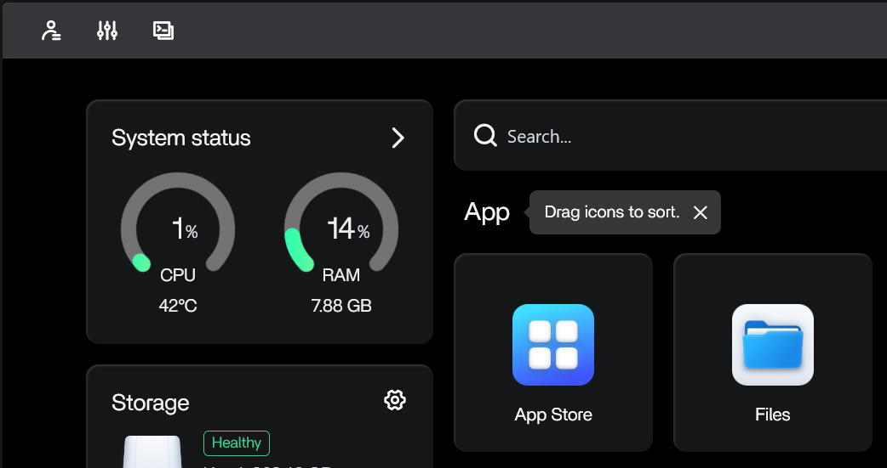

# Assemble Your Raspberry Pi

Follow these instructions to assemble your Raspberry Pi.

**Note:** These instructions are specific to the Raspberry Pi 5. They may be generally applicable to other models of Raspberry Pi, but this isn't guaranteed. We will add additional instructions for other Pi models as we're able.

## Terms Used in This Section

- Electrostatic Discharge: Commonly known as "static electricity". Caused when there is a substantial difference in the electrical charge between two objects. Electrostatic discharge can damage computer components.
- Motherboard: A printed circuit board with various chips and ports soldered to it. All the parts of a computer attach to the motherboard in some way. Think of it like the computer's nervous system.
- Solid State Drive (SSD): A more modern primary local storage device for computers. These serve as a computer's permanent memory, and are commonly mounted directly on the motherboard. Solid state drives have no moving parts, so they can store more information in a much smaller space and can read and write that information much more quickly than hard disk drives (HDDs) can. Modern SSDs are also somewhat more reliable than comparable HDDs. However, they cost more per amount of storage capacity than HDDs. SSDs are *not* the same as SD/microSD cards, and are *not* interchangeable.
- Hard Disk Drive (HDD): Also known as "hard drives" or "hard disks". An older primary local storage device for computers which serve as a computer's permanent memory, and are commonly mounted within the computer case. Hard drives store information on spinning magnetic disks. Because HDDs have many moving parts, they take up more space and have slower read and write times than comparable SSDs. However, they are cheaper than SSDs (as of this writing, a 20 terabyte external HDD cost about $280. An external SSD with the same capacity would cost at least 3-4x that much).
- Universal Serial Bus (USB) port: An interface which lets users connect peripheral devices to computers. USB ports let computers and their peripheral devices exchange data and supply power. USB ports are famous for being nearly impossible to connect on the first try. On the Raspberry Pi, these are metal enclosures soldered to one side of the motherboard.
- Ethernet port: An interface which enables computers to be physically connected to a local network (and therefore the internet) via an Ethernet cable. In general, Ethernet provides a faster connection than Wi-Fi. On the Raspberry Pi, this is a metal enclosure that sits next to the USB ports.
- Wi-Fi: A protocol which allows computers to wirelessly connect to the internet. On the Raspberry Pi, Wi-Fi access is managed by a small chip on the motherboard.
- Heatsink: A device which cools electrical and mechanical devices through heat exchange. For the Raspberry Pi, these are metal parts comprised of a flat contact plate and several metal fins which stick up off the plate. The fins increase the surface area of the heatsink which is exposed to air, which increases how much heat it can dissipate.
- Thermal paste: A thick liquid which transfers heat very efficiently. Placed between a heatsink and the device it's cooling to facilitate heat transfer to the heatsink. On the Raspberry Pi's heatsinks, thermal paste is mildly adhesive and pre-applied to the contact plate of the heatsinks.
- Case: The enclosure for a computer which protects the sensitive internal components. For the Raspberry Pi 5, this is a red and white plastic box.
- Case fan: A fan that's attached to a computer case to cool the computer. Case fans either push hot air out of the case or pull cool air into it.
- External drive: Short for "external solid state drive" or "external hard disk drive". These are SSDs or HDDs which are in portable mounts which are separate from a computer's case and which connect to the computer through USB. External drives are often used for backup storage. For the Raspberry Pi, this will be the primary storage, and are external only because they can't fit in the Pi's case.
- Central Processing Unit (CPU): The part of a computer which runs programs. Think of it as a computer's brain.
- Random Access Memory (RAM): RAM is temporary memory which the CPU uses for programs which it's actively running. Unlike SSDs and HDDs, RAM does not save information when it loses power.
- I/O controller: A component which controls all input to and output from a computer.

## Parts of the Raspberry Pi 5

Figure 0: Relevant parts of the Raspberry Pi 5

1. Motherboard (green plastic printed circuit board)
2. CPU
3. RAM
4. I/O controller
4. Wi-Fi chip
5. USB ports
6. Ethernet port
7. Case fan connector

**Caution:** Discharge static electricity before working with electrical components such as motherboards, SSDs, or HDDs. While working with electrical components, you should also remain electrically grounded. If you don't, electrostatic discharge (a.k.a. static electricity) could damage your computer. To discharge static electricity, touch a metal object which is touching the ground such as the leg of a desk, table, or a light switch. To remain electrically grounded, remain in contact with the work surface.

**Warning:** The Raspberry Pi is a temperature sensitive device. Excessive heat can degrade its performance, and extreme heat could damage it. When in operation, keep your Pi in a shaded location with good airflow and away from sources of heat. If your Pi is regularly running at over 45 C, move it to a cooler location and/or follow this link for [Raspberry Pi cooling advice](../Instructions/Getting_The_Most_Out_Of_Your_Pi.md). If you live in a hot climate, pay attention to the temperature monitor (this which will be discussed later in the guide).

## Assembly Instructions

1. Gather your parts. Remove everything from its packaging (carefully, so that you can return anything which is broken) and visually inspect it for damage or missing pieces (damage could include cracks, cuts, rust, or corrosion). You should have:

	Figure 2: Raspberry Pi parts (mostly in their packaging)

	1. The Pi motherboard
	2. The case and case fan
	3. The power supply
	4. Three extra heat sinks
	5. An external drive
	6. The enclosure and USB cable for the SSD
	7. An ethernet cable (optional, not pictured)

2. Place the Pi motherboard in the base of the case as shown in Figure 3. The USB and Ethernet ports should be on the side of the case with lower walls.

	Figure 3: Raspberry Pi within the bottom of the case

3. Apply the four heatsinks as shown in Figure 4. You should test fit the heatsinks before applying them permanently.

	**Note:** The heatsinks are not exactly the same size as the components you apply them to. This is normal.
	
	**Note:** If you have large fingers or are clumsy (like this author is), you may have to remove the motherboard from the case base for this step. If you do, place the motherboard back in the base of the case after installing the heatsinks.
	
	To apply the heatsinks:
	
	1. Remove the paper backing on the bottom of a heatsink. This will expose the adhesive thermal paste.
	
	**Caution:** Do not touch the adhesive thermal paste, and do not let anything get on it before applying the heatsink.
	
	2. Align the heatsink with the appropriate component and gently set it on the component. *Gently* press the heatsink onto the component to secure it.
	3. Repeat this process for the rest of the heatsinks.

  Figure 4: The Raspberry Pi with heatsinks applied

4. Gently remove the cover on the case fan connector (see Figure 0), then plug the case fan into the motherboard.

5. Attach the case fan to the base of the base.
	1. Align the locking tab on the case fan mount with the locking tab slot on the base of the case, then insert the tab into the slot. You will need to angle the case fan mount to insert the tab (see Figure 5).
	2. Lower the case fan mount onto the base.

	Figure 5: Attaching the case fan
	
	1. Locking tab
	2. Locking tab slot

6. Set the case cover on top of the case fan mount.

  Figure 6: Completed Raspberry Pi 5
