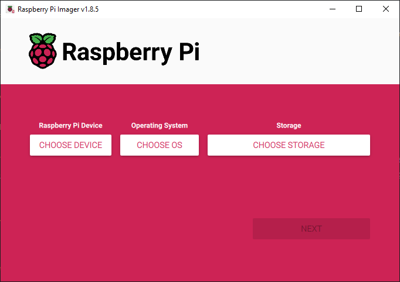
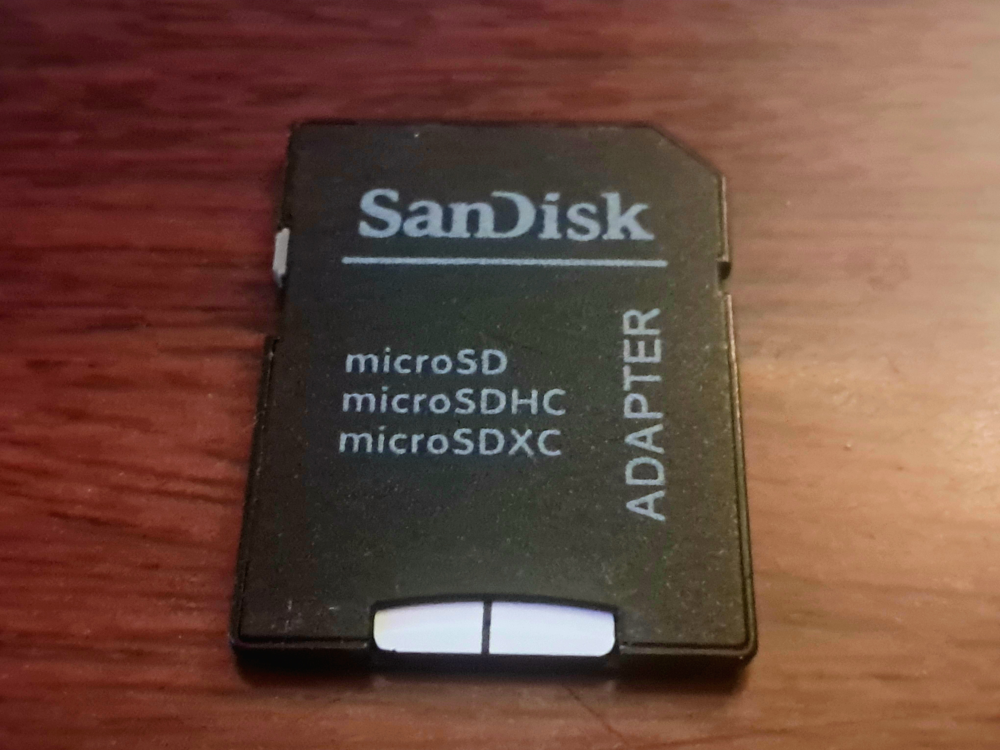
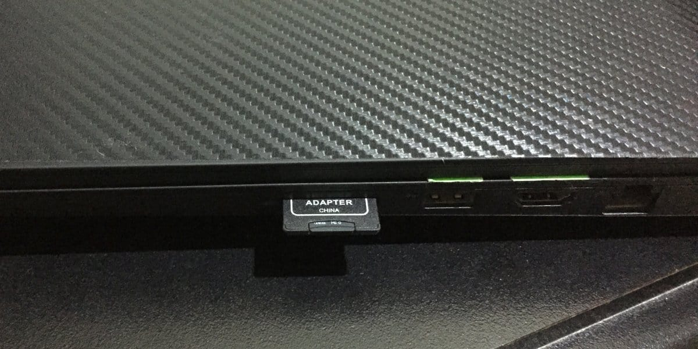
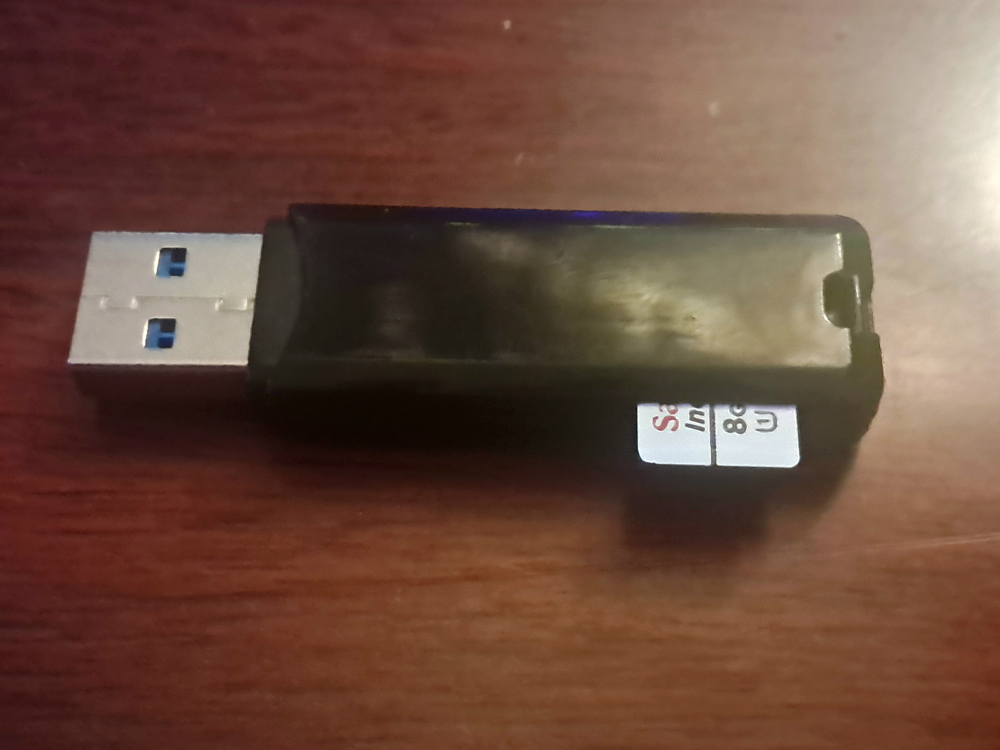

To-do: 
(plenty of pictures for all of this!)
- List of passwords, usernames, etc that people will need to make, right at the beginning. 
- - Advice on password security.
- How to connect to the Pi for the first time.
- How to set up Raspberry Pi OS / dietPi.
- - How to set up CasaOS, if it's being used.

# __Full Home Server (Advanced)__

If you have not already done so, install the [Raspberry Pi Imager](../Software_Repository/Raspberry_Pi_Imager.md) on your computer. This lets you turn your Raspbbery Pi from a lump of silicon into a working computer you can talk to.

Place your SSD into your external SSD enclosure. Plug the enclosure's power supply into a wall outlet. Plug the enclosure's USB 3.0 cable into your computer.

 

# __Secure Communication Only (Advanced)__

Plug your micro SD card into your computer. You computer may have a micro SD card slot like this, in which case you can plug it in directly. 

 

Your computer may have an SD card slot, in which case you need to put your micro SD card into an SC card adapter (this comes with the purchase of most micro SD cards), then plug that into your computer.

   

If you computer does not have either of those slots, you may need to put your micro SD card in a USB adapter (found in [Equipment_List](../Equipment_List#optional-hardware)), then plug that into your computer.

  to-do: last image
