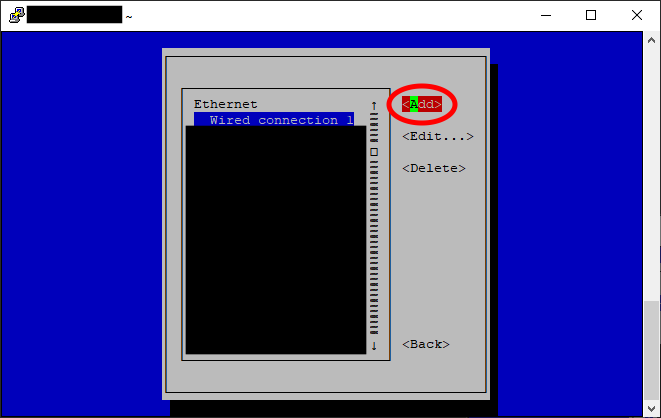
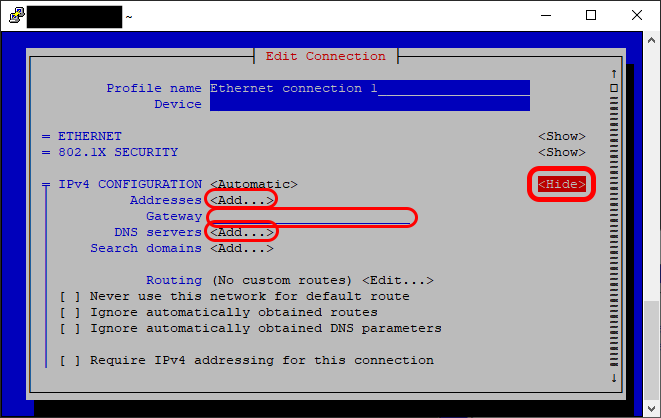

to-do: 
- Check if `pi` and `raspberry` are the default root username and password like this, and if there's a seperate `root` user by default, whose password needs to be changed.
- Add a section about how to change your wifi name and password if those change.
- Include instructions for Macs and Ubuntu.

# __SSH Setup__

SSH means "Secure Shell", referring to the Secure Shell Protocol. An SSH program (like PuTTY) lets you talk to your Pi from your computer in a secure way. This lets us type commands into a text field, press enter, and have the Raspberry Pi execute those commands.

Note: Terminal windows often do not accept `ctrl+v` commands to paste content. If you want to paste the following commands, you may have to right-click in the terminal window (on some systems this automatically pastes text) or right-click and select paste.

0. In a previous step you created a **Pi hostname**, **Pi username**, and **Pi password**. Make sure you have all three ready for this step. During these steps you will also learn your **router's local IP address**, and set your **Pi's local IP address**. These should both be written down and saved permanently.

1. If you are using Windows, download and install [PuTTY](../Software_Repository/SSH.md). Make sure to create a desktop shortcut for PuTTY, and open it up.

2. In the field for `Host Name (or IP address)`, enter your Pi hostname followed by ".local", like this `[exampleHostname].local`. This will take you to a mostly black window with only text saying `login as:`. This is known as the "terminal" window. Enter your Pi username and press Enter. Enter your Pi password (no text will appear, this is a normal security measure) and press Enter.
  - If this works, some more text will appear and the bottom line will read `[exampleHostame].[exampleUsername]:~ $`. This means your computer is speaking to a machine named `exampleHostname` (this is your Pi), and you are logged in as `[exampleUsername]`. Additionally, the `~` means you are accessing the home directory of your Pi, and the `$` means you are a normal user.
  - If you get a black screen without text, your Pi is probably not finished setting up. Exit the screen and try again in a few minutes.
  - If you get an error message, particularly anything about a software error, you probably got your wifi details wrong in the previous step.
  - If your password does not work, you may have entered the password wrong. If retrying your password more carefully does not work, you may have entered it wrong in the Raspberry Pi Imager. [Repeat that step.](../Instructions/Raspberry_Pi_Image_Setup.md)
 
  

3. Next you need to update your Raspberry Pi. Type `sudo apt update` and hit enter. This tells your Pi's Advanced Package Tool (APT) to run an update. `sudo` indicates that you are using administrator privileges to do so (you are telling it to update very sternly). Some text will scroll across your screen, about what is getting updated. When that is finished, type `sudo apt upgrade -y`. This tells your Pi's Advanced Package Tool (APT) to upgrade all of the underlying code packages and modules, and `-y` tells it to say yes to any "are you sure you want to upgrade this?" questions. More text will scroll across your screen, about what is getting updated.

 

4. Next you need to get your  **router's local IP address**. If your **router's global IP address** is the mailing address for your piece of the internet, this is the personal name of the doorkeeper who brings the mail in. Type `ip -br route` and press Enter. This tells your Raspberry Pi to tell you your **router's local IP address**, and to be brief (-br) about how much information it gives you. One of the lines which pops up will say **default via XXX.XXX.XXX.XXX ...**, where each **XXX** can be 1, 2, or 3 digits. This is your **router's local IP address**, record it.

  - If you are connecting your Pi to your router via ethernet, you may see two lines saying **default via XXX.XXX.XXX.XXX ...**. If so the numbers in **XXX.XXX.XXX.XXX** should be the same for both. If not, use the line which has **eth0** in it. This is your **router's local IP address**, specifically for ethernet.

Finally, you need to declare your **Pi's local IP address**. This is different from your **router's local IP address**. If your **router's local IP address** is the name of the doorkeeper, this is the name of the person mail is addressed to.

5. First you need to check what other **local IP addresses** are currently in use, because it would cause problems if gave your Pi the same address as your phone. Type `ip -br neighbor` and press enter. You're going to see some lines of text. You care about any lines which start with the same first three **XXX** sequences as your **router's local IP address**, including your **router's local IP address** itself. These are "neighboring" devices connected to your router, like your phone or computer. Write down the last **XXX** digits (which can be 1, 2, or 3 digits) of each such sequence.

6. type `sudo nmtui` and press Enter. This will take you to the Network Manager Tool User Interface, and you should see `Edit a Connection` highlighted in red. Press Enter to select it. Next, use the `right arrow key` to move your selection over to `Add` and press enter again.

  

7. This next step depends on if you are using a wired ethernet connection to connect your Raspberry Pi to your internet router (recommended!), or using a wireless wifi connection. If you plugged your Pi into your router during the [Raspberry Pi Assembly step](../Instructions/Raspberry_Pi_Assembly.md), you are using a wired ethernet connection. Use the `up/down arrow keys` to select `Ethernet` or `Wi-Fi`, depending on your choice, and press Enter.

 

8. Use the `arrow keys` to select the `<Show>` button to the right of the text which says `IPv4 CONFIGURATION`. Press enter. This will open a menu where you can tell your Raspberry Pi what its **local IP address** should be. Use the `arrow keys` to navigate to each of the following fields, and enter the following information:

 
  
  - `Addresses`: Highlight `<Add...>` and press Enter. Type the first three parts of your **router's local IP address**, with a period **.** after each part. This will be of the form: **XXX.XXX.XXX.**, where each **XXX** can be 1, 2, or 3 digits. Now check your list of "neighboring" device numbers from step 5, and type in any number from **1-999** which is not on that list. (You do not need to press Enter after this.) 

 

  - `Gateway`: Select this field. You will know you are in the right field by the bright green cursor. Type your **router's local IP address**. This tells your Raspberry Pi that it will be recieving information packets from your router.

- `DNS Servers`: These are "Domain Name Servers", which are address books like the Yellow Pages where all of the internet's **global IP addresses** can be found. Highlight `<Add...>`, press Enter, and type in `1.1.1.1`. Go down, highlight the new `<Add...>` button, press Enter, and type in `8.8.8.8`. This tells your Raspberry Pi to first ask Cloudflare (1.1.1.1) if it needs an address, and then Google (8.8.8.8) if Cloudflare doesn't know.

   

9. Use the `arrow keys` to scroll all the way down to `<OK>` and press Enter. Use the `right arrow key` and then the `down arrow key` to select `<Back>` and press Enter. Use the `down arrow key` to scroll down to `Quit` and press Enter.

   

10. Now one more thing. As is, your Pi will time out and drop connections to other devices if those connections are left idle for too long. That's not good for a home server, which might need to keep connections open for a long time without input to transfer data. Type in `sudo nano /etc/ssh/sshd_config`. This tells `nano`, the Linux program which is used to edit text, to open up the file containing your SSH (Secure Shell Protocol) settings. (Remember, you're using an SSH program to connect to your Pi right now.)

You are ready for the next step, where we will finally leave all this terminal business behind! Follow the link below that matches the setup you want.

[Full Home Server](../Instructions/CasaOS_Setup.md) 

Secure Communication Only
